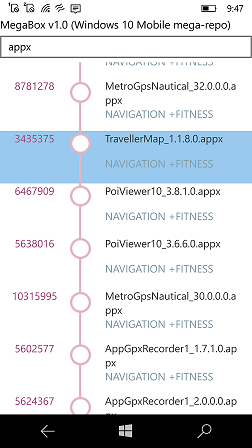
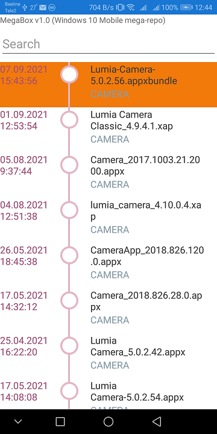

# MegaBox 1.0

## About
Simple Mega's file downloader & launcher (special for Windows 10 Mobile Telegram group))

Used Mega Storage URL : https://mega.nz/folder/SKZxnQAR#EvlQqjMIVQwoxcje9r-jAw

## Screenshots

## Features
- Easy mode (no settings, etc.) 
- No folders
- Autolaunch downloaded file (RnD, "As-Is")
- App Search (sloooowest, but works)))

## System requirements
- Minimal Windows 10 Mobile os's build: 15063

## Quick Start for your own experiments and my code modifications
- Clone the repo from GitHub
- Open in Visual Studio 022 Preview
- for start this Xamarin app at Windows 10 Mobile (Phone), choose target "ARM";  
to run this Xamarin app at Windows 10 (Desktop), choose target "x86". 

## .
AS IS. No support. RnD only.

## ..
-- [m][e] 2022
